```{r setup, include=FALSE}
knitr::opts_chunk$set(echo = FALSE,warning=FALSE, fig.pos= "h")
```


```{r libraries, warning = FALSE, error = FALSE, message = FALSE, include=FALSE}
library(tidyverse)
library(dplyr)
library(ggplot2)
library(reshape2)
library(gridExtra)
library(GGally)

```

# Linear Regression

**Regression** generally refers to predicting a real number. However, it can also be used for classification (predicting a class or category).

The term **linear** refers to the fact that the method model data with linear combination of explanatory variables.

linear combination is an expression where one or more variables are scaled by a constant factor and added together.

## Simple Linear regression:

We assume that the *true* relationship between X and Y takes the form  $Y=f(X)+ \epsilon$, for some unknown function f, where $\epsilon$ is a mean- zero random error term. If *f* is to be approximated by a linear function, then we can write this relationship as
\[Y = \beta_0 + \beta_1 X + \epsilon \]
Here $\beta_0$ is the intercept term and it is the expected value of Y when X=0, and $\beta_1$ is the slope- the average increase in Y associated with a one-unit increase in X. 
The above model defines the **population regression line**, which is the best linear approximation to the true relationship between X and Y. The least squares regression coefficient estimates characterize the *least squares line*, defined by 
\[ \hat y  = \hat \beta_0  + \hat \beta_1 x \].
  -- **least square estimates** are *unbiased* estimations.
 \[ \hat \beta_1  = \frac{\sum _{i =1}^n (x_i  - \bar x)(y_i  - \bar y)}{\sum _{i=1}^n (x_i  - \bar x)^2}  \]
 
 \[ \beta_0  = \bar y - \hat\beta_1  \bar x \]

  -- If we wonder how close $\hat \beta_0$ and $\hat \beta_1$ are to the true values $\beta_0$ and      $\beta_1$. To compute the standard errors associated with $\hat \beta_0$ and $\hat \beta_1$, we use the following formulas:
  \[SE(\hat \beta_0 )^2 = \sigma^2 [\frac{1}{n} + \frac{\bar x^2}{\sum_{i=1}^n (x_i -\bar x)^2}]\]
    \[SE(\hat \beta_1 )^2 =  \frac{\sigma^2}{\sum_{i=1}^n (x_i -\bar x)^2}.\]
    
Here we assume that each observation have common variance $\sigma^2$. Notice in the formula that SE($\hat \beta_1$) is smaller when the $x_i$ are more spread out.

For linear regression the 95% confidence interval for $\beta_1$ approximately takes the form
\[\hat \beta_1 \pm 2SE(\hat \beta_1). \]
Similarly, the confidence interval for $\hat \beta_0$ approximately takes the form
\[\hat \beta_0 \pm 2SE(\hat \beta_0). \]

### The accuracy of the model
#### Residual Standard Error

We know that associated with each observation is an error term $\epsilon.$ Due to these error terms, even if we know the true regression line i.e. if $\beta_1$ and $\beta_0$ were known, we would not be able to perfectly predict Y from X. The RSE is an estimate of the standard deviation of $\epsilon.$ Actually, it is the average amount that the response will deviate from the true regression line. It is computed using the formula
    \[ RSE = \sqrt {\frac{1}{n-2}RSS} = \sqrt {\frac{1}{n-2} \sum_{i=1}^n (y_i - \hat y_i)^2}.\]
    
 
#### $R^2$ statistic

   The RSE is considered as a measure of the **lack of fit** of the model to the data. But since it is measured in the units of Y, it is not always clear what constitutes a good RSE. The $R^2$ statistic provides an alternative measure of fit. It takes the form of proportion, the proportion of variance explained and is independent of the scale of Y. To calculate $R^2$, we use the formula
   
   \[ R^2 = \frac{TSS - RSS}{TSS}\]
   
   where $TSS = \sum(y_i - \bar y)^2$ is the total sum of squares. TSS measures the total variance in the response Y, and can be thought of as the amount of the variability inherited in the response before the regression is performed. RSS measures the amount of variability that is left unexplained after performing the regression. Hence, the TSS - RSS measure the amount of variability in the response that is explained by performing the regression, and **$R^2$ measures the proportion of variability in Y that can be explained by X.**
   --- In typical application in biology, marketing and other domains, we would expect only a very small proportion of the variance in the response to be explained by the predictor, and an $R^2$ value well below 0.1 might be more realistic.

### Variable selection

It is possible that all of the predictors are associated with the response, but it is more often the case that the response is only associated with the subset of predictors. This is called the variable selection. There are a total of $2^p$ models that contain subsets of $p$ variables. Therefore, trying out every possible subset of the predictors is in-feasible. There are three classical approaches for this task:

- *Forward selection*. We begin with the *null model* and then to the present model the variable that results in the lowest RSS.

- *Backward selection*. We start from all variables and then remove the variable with the largest *p-value*. We continue until all remaining variables have a *p-value* below some threshold.

- *Mixed selection*. This is a combination of forward and backward selection. We start from no variables in the model and as with forward selection, we add the variables that provide the best fit. Of course  the *p-value* for variables can become larger as new variable are added to the model. Hence, at any point the *p-value* for one variable in the model raise above a certain threshold, then we remove that variable from the model. We continue until all variables in the model have a sufficiently low *p-value* and all variables outside of the model would have a large *p-value* if added to the model.

### Synergestic Effect

The linear model overestimate dependent variable in the case where most of advertising money was spent exclusively on either TV or radio. and underestimate where the budget was split between the two media. This non-linear pattern suggest a *synergy* or *interaction* effect between variables, whereby combining the variables together results in a bigger boost to sale (dependent variable) than using  any single variable. In this case we extend the linear model to accommodate such synergistic effect.   

### Reducible and irreducible error

- The coefficient estimates $\hat \beta_0, \hat \beta_1, ..., \hat \beta_p$
are estimates for $\beta_0, \beta_1, ..., \beta_p$, that is the *least square plane* 
\[\hat Y =  \hat \beta_0+ \hat \beta_1 X_1+ ...+ \hat \beta_p X_p \] is only a estimate for the *true population regression plane* 
\[ f(X) =   \beta_0+  \beta_1 X_1+ ...+ \beta_p X_p \]

The inaccuracy in the coefficient estimates is related to the *reducible error*.

- Of course assuming a linear model for $f(X)$ is almost always an approximation of reality, so there is additional source of error which is called *model bias*.

- Even if we know the true values for $\beta_0,  \beta_1, ..., \beta_p$, the response value can not be predicted perfectly, because of the random error $\epsilon$ in the model. This is called *irreducible error*


### Additivity and linearity

Two of the most assumptions in linear regression states that the relationship between the predictors and response are **additive and linear.**
The additivity assumption means that the association between a predictor and the response does not depend on the values of other variables. The linearity assumption states that the change in the response associated with a one unit change in the independent variable $X_j$ is constant, regardless of the value of $X_j$.
Consider the linear model, 
\[ Y =   \beta_0+  \beta_1 X_1+ \beta_2 X_2 \]
As an example, let's say you changed the value of $X_2$ by adding 1, such that $\tilde X_2 = X_2 + 1$, then you would have:

$$ \tilde y =  \beta_0+  \beta_1 X_1+ \beta_2 \tilde X_2 = \beta_0+  \beta_1 X_1+ \beta_2 (X_2 + 1)$$
$$ = \beta_0 +  \beta_1 X_1 + \beta_2  X_2 + \beta_2 = y + \beta_2 $$
So you can see pretty clearly, the effect of one-unit change of $X_2$ on $y$ does not depend on the values of $X1$ (additivity) and also on the values of $X_2$(linearity).


## Multiple regression
 The simple and multiple regression coefficients can be quite different. Because in the simple regression case, the slope term represents the average increase in Y associated with a one unit increase in X ignoring other variables. By contrast, in the multiple regression the coefficient represent the average increase in Y associated with increasing one unit in X while holding other variables fixed.
 
 --- The shark attacks and ice cream sale example shows that how a variable in simple regression can be significant, while in multiple regression does not.

- standardize coefficients

- multi-colinearity

- $R^2$ indicates total variability captured by independent variables.


- F-statistic.  \[H_0:\beta_1 = \beta_2 = \beta_3 = 0\]
                \[H_1: \text{at least one } \beta_{i} \neq 0\]
is called overall test. If F-statistic reject the Null hypothesis then go through p-values.

\[ F = \frac{\frac{(TSS - RSS)}{p}}{\frac{RSS}{n - p - 1}}\]

when there is no relationship between the response and predictors, one would expect the F-statistic to take on a value close to 1.

- Question: Given the p-values for each predictor, why do we need to look at the overall F-statistic. If we have 100 predictors and $H_0:\beta_1 = \beta_2 = ...  =\beta_p = 0$ is true, so no variable is truly associated with the response. In this case about 5% of the p-values associated with each variable will be below 0.05 by chance. In other words, we expect to see approximately five small p-value even in the absence of any true association between the predictors and the response. However, the F-statistic does not suffer from this problem because it adjusts for the number of predictors.

- The approach of using an F-statistic to test for any association between the predictors and the response works when p is relatively small, and certainly small compared to *n*. If *p>n* then there are more coefficients to estimate than observations from which to estimate them. In this case we can not even fit the multiple regression model using least squares, so the F-statistic can not be used. When *p* is large, some of the approaches such as *forward selection* can be used.   
                
- Gradient descend is used to find the best parameters for linear regression.

- There are twp types of variances: stochastic and deterministic. Stochastic variance is noise.
The variance of dependent/independent variable is deterministic, but the variance around the model is noise.

- Different types of errors in linear regression.

1. sum of square error (non-deterministic error): 
$$Error =  \frac{\sum_{i =1}^{n} (\hat{y} - y_i )^2}{n}$$
The line $\hat{y}$ which gives sum of squared errors is considered as the best line.

2. Total error is the difference between the actual data points and the mean value of y-values.

3. regression error is the difference between the predicted value and the mwan value of y-values.


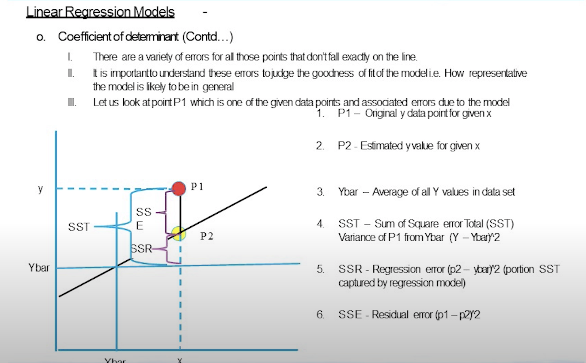

- Coefficient of determination, $R^2$: How much of total variance in Y (deterministic or stochastic) has been explained by your model. $R^2$ should be close to 1, if the model is good.
In another words, $R^2$ is the proportion of the variation in the dependent variable that is predicted from the  independent variable.

$$ R^2 = 1 - \frac{RSS}{TSS}$$
- Adjusted coefficient of determination. When we include some useless variables in the model, the $R^2$ will increase, but the **Adjusted coefficient of determination** will decrease. Adjusted Rsquare compare two models with the same dependent variable.

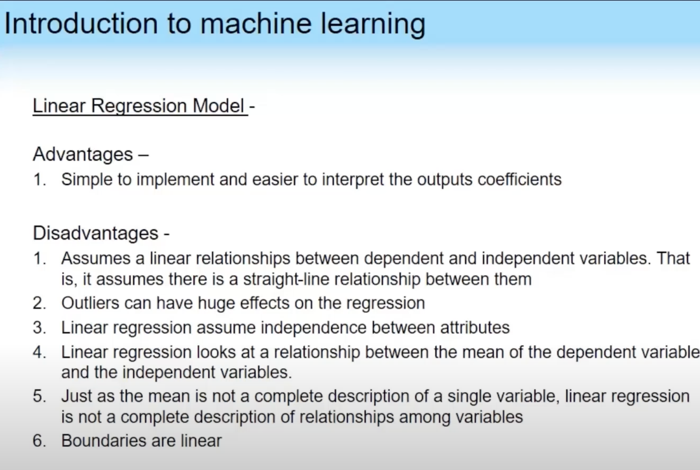


### Potential Problems

- Non-linearity of the data: *Residual plots* are a useful graphical tool for identifying non-linearity. In this plot on x-axis we have the Fitted value and on y-axis we have the Residuals. The presence of a pattern may indicate a problem with some aspect of the linear model.

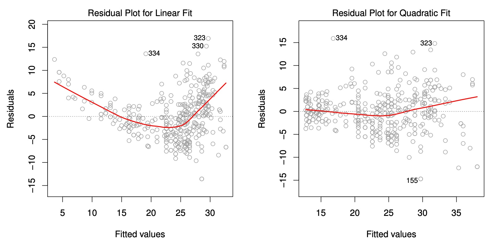

- Correlation of Error Terms: An important assumption of the linear regression model is that the error terms for n observations, $\epsilon_1,\epsilon_2,...,\epsilon_n$ are uncorrelated.
The standard errors that are computed for the estimated regression coefficients or the fitted values are based on the assumption of uncorrelated error terms. If there is a correlation among the error terms, then the estimated standard errors will tend to underestimate the true standard error. As a result, confidence intervals for predictions will be narrower than they should be. In addition, *p-values*  associated with model will be lower than what they should be. In cases where, observations are obtained at adjacent time points will have *positively correlated errors.* In this case, we need to plot the residuals as a function of time and the correlation between error terms for adjacent time points show the correlation of Error terms.


- Non-constant Variance of Error terms: Another important assumption of the linear model is that the error terms have a constant variance, $Var(\epsilon_i) = \sigma ^2.$ The standard errors, confidence intervals, and hypothesis tests with the linear model rely upon this assumption.

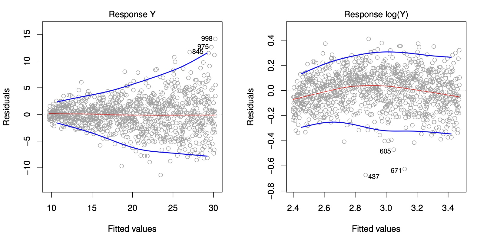

Unfortunately, it is often the case that the variance of the error terms are non-constant. For example the variance of the error terms may increase with the value of the response. Non-constant variance in the errors is called *heteroscedasticity*, form the presence of a **funnel shape** in the residual plot.  In this case one solution is to transform the response Y using a concave function such as $logY$ or $\sqrt Y.$ Such a transformation results in a greater amount of shrinkage of the larger response leading to a reduction in heteroscedasticity.

Some time we have a good idea of the variance of each response. For example, the $i$th response could be an average of $n_i$ raw observations. If each of observations is uncorrelated with variance $\sigma^2$, then their average has variance $\sigma_i^2 = \frac{\sigma^2}{n}.$  In this case the simple solution is to fit our model by *weighted least squares,* which weights proportional to the inverse variance, i.e. $w_i = n_i$.

- Outlier: an outlier is a point for which $y_i$ is far from the value predicted by the model. Outlier would affect the RSE and since the RSE is used to compute all confidence intervals and *p-values*, such a dramatic increase caused by a single data point can have implications for the interpretation of the fit. Similarly, inclusion of the outlier causes the $R^2$ to decline from 0.892 to 0.805.

Residual plot can be used to identify outliers. Observations whose studentized residual are greater than 3 in absolute value are possible outliers, and to be removed.

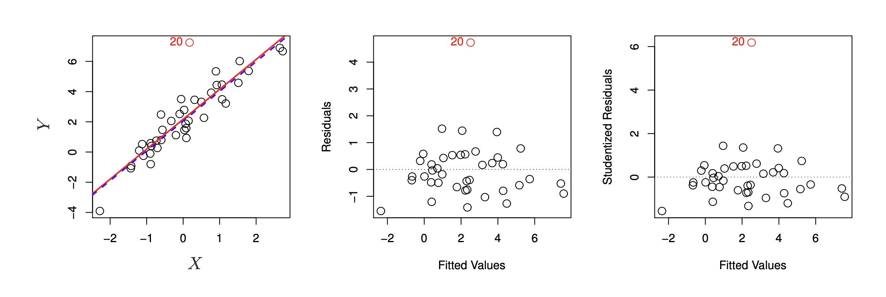

- High leverage Points: Outlier are observations for which the response $y_i$ is unusual, in contrast, observations with high leverage have an unusual value for $X_i$. Removing the high leverage observation has a much more impact on the least square line than removing the outlier.
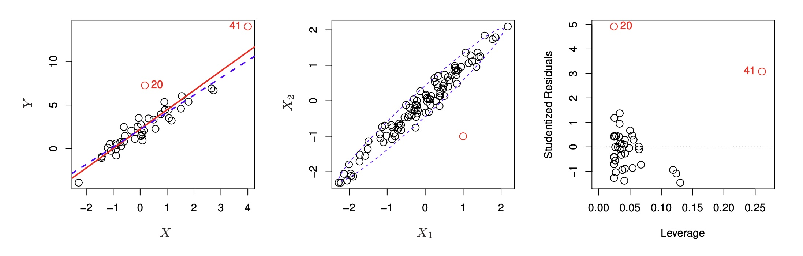
The leverage statistic for a simple linear regression is as follows.
$$h_i = \frac{1}{n} + \frac{(x_i- \bar x)^2}{\sum_{i=1}^n (x_i - \bar x)^2}$$
The larger the value of the leverage statistic, the higher leverage. The right-handed of above figure provides studentized residuals versus $h_i$. Observation 41 has a very high leverage and high studentized residuals. This is a dangerous combination.

- Collinearity: *Collinearity* refers to the situation in which two or more predictor variables are closely related to each other. The presence of collinearity can pose problems in the regression context, since it can be difficult to spread out the individual effect of collinear variables on the response variable.
Collinearity reduces the accuracy of the estimates of the regression coefficients, it causes the standard errors for $\hat \beta_j$ to grow. As a result in the presence of the collinearity, the probability of correctly detecting of non-zero coefficients- the power of test- is reduced by collinearity.
One way to assess multiple collinearity is to compute the *variance inflation factor (VIF)* 

$$VIF(\hat \beta_j) = \frac{1}{1 - R^2_{X_j|X_{j-1}}}$$
where $R^2_{X_j|X_{j-1}}$ is the $R^2$ from a regression of $X_j$ onto all of the other predictors. If $R^2_{X_j|X_{j-1}}$ is close to one, then collinearity is present and so the VIF will be large.
As a rule of thumb, a VIF value that exceeds 5 or 10 indicates a problematic amount of collinearity.

When faced with the problem of collinearity, there are two simple solutions. The first is to drop one of the problematic variables from the regression and the second is to combine the collinear variables together into a single predictor. For example, we might take the average of standardized versions of collinear variables in order to create a new variable that measures both variables.


- low variance filter means to ignore data columns that does not have enough variance.

- Male or Female can not be replaced with 0 or 1. Since in this case, Male and Female will have order. In this case we should define two variables male and female and set the value of male column to 1 if the gender of the sample is male.

- If two independent variable are highly correlated, we need to keep only one variable. In this case we can use previous knowledge and drop out the variable that has higher error in measurement or use principal component analysis to merge this two variables.

- Normalization on independent variables does not affect the result of linear regression. Since it does not affect the correlation between variables.

- Best fit line go through the $(\bar{x} , \bar{y})$

- The total sum of squares of the observed $y_i$ about their average $\bar{y}$ is the total amount of variability in the dependent variable. 
$$\sum_{i=1}^{n} (y_i - \bar{y})^2 = \sum_{i=1}^{n} (y_i - \hat{y_i})^2 + \sum_{i=1}^{n} (\hat {y_i} - \bar{y})^2$$
This amount is partitioned into the sum of squared values of the observed values about the fitted values plus the sum of squared residuals. The sum of squred residuals is reffered to as the error sum of squares or the unexplained sum of squares. 

The sum of squares about the fitted values $\hat{y_i}$ is the amount of variability attributed ti knowing the explanatory variable $x_i$. This is called the *explained* or *model sum of squares*. Ideally we want the model sum of squares to be large relative to the error sum of squares. 

- For every parameter (coefficient) in the regression model, R provides an estimated value and a standard error of that estimate. The    
  t-value is the ratio
  
  $$\text{t-value} = \frac{\text{Estimate}}{\text{Std.Error}}$$
The corresponding statistical significance of this t-statistic appears under Pr[>|t|]. This tests the null hypothesis that the true, underlying population parameter is actually zero. A small p-value for this test indicates that the
strong relationship between the variables could not have happened by chance alone.

- If we obtain a negative coefficient for a variable that is expected to have a positive correlation with the dependent variable, it can be attributed to the presence of multicollinearity.

### Comparison of KNN with Linear regression

- In general, the optimal value for K in KNN depend on the *bias-variance trade off*

- The following figure compares the results of KNN when K = 1 (left figure) and K = 9 (right figure). When K increases the fitted curve using KNN  represents a smoother fit.
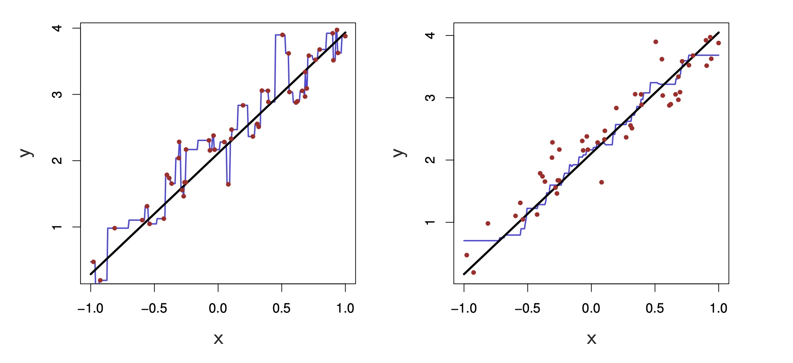

- When the true model is linear, the least square regression line provides a very good estimate compared with KNN.
Since the true model is linear, the best result for KNN occur with a very large value of K. 
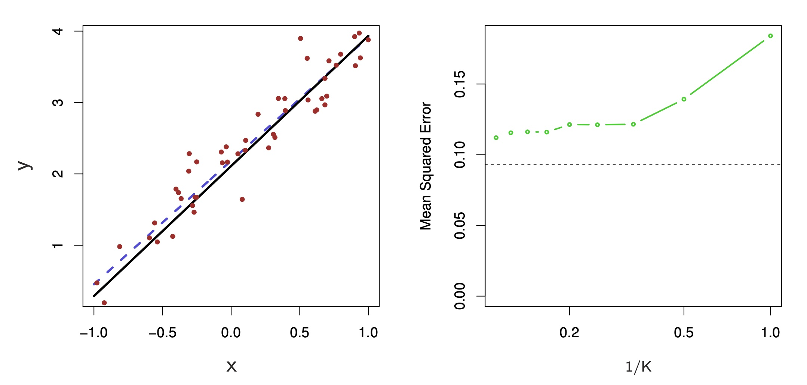

when the true model is non-linear, KNN outperforms linear regression.The following top figure is an example of slightly non-linear data and the bottom is a strongly non-linear.
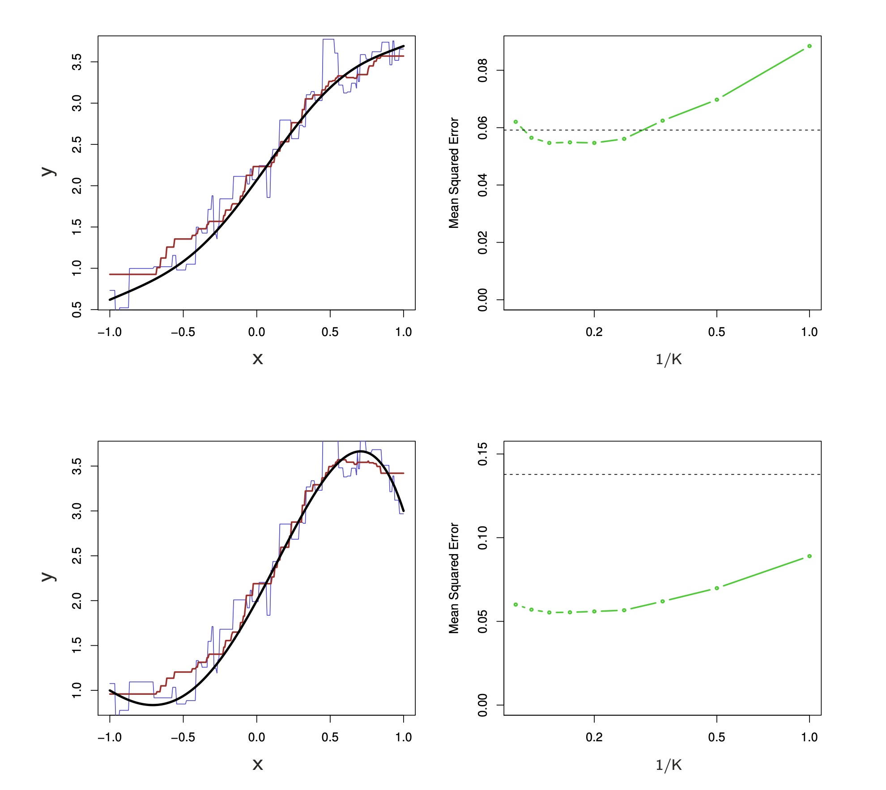
The following figure consider similar situation where there is strongly non-linear relation. When p = 1 or p = 2, KNN outperforms the linear regression. for p = 3 the results are mixed and for p >=4 linear regression is  superior to KNN. In this case where there are 50 observations, spreading 50 observations over 20 dimension has only a small effect on the linear regression in the MSE, but has more than ten-fold increase in the MSE for KNN.
Spreading 50 observations over p = 20 dimensions results in a phenomenon in which a given observation has no nearby neighbor. This is called *curse of dimensionality*. That is the K observations that are nearest to a given test observation may be very far from that point in p-dimensional space when p is large, leading to a very poor prediction of f(x) and hence a poor KNN fit.
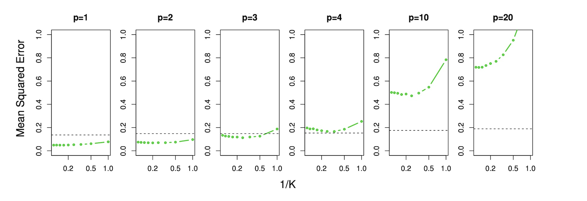


As a general rule, parametric methods outperform non-parametric approaches when there is a small  number of observations per predictor.

Even when the dimension is small, we might prefer linear regression to KNN from an interpret ability standpoint. If the test MSE of KNN is only slightly lower than that of linear regression we prefer to use a simple model that can be described in terms of a few coefficients. 


- The following output includes an estimate of 2.5 for the standard deviation of the errors associated with the linear model. That is, the fitted model 
estimates the mpg with a standard deviation of about 2.5. To appreciate the value of the regression, let us compare this value to the standard deviation
of the marginal mpg values, sd(mtcars$mpg)=  6.026948 illustrating the much higher variability associated without the use of the linear model.

```{r}
str(mtcars)
data<-dplyr::select(mtcars,mpg,cyl,wt,am,carb)
ggpairs(data)
```

Before fitting linear models,let’s examine the independence of our potential predictors and the dependent variable. Multiple linear regressions assume that predictors are all independent with each other.Is this assumption valid?

```{r}
cor(data[c("cyl", "wt", "am","carb")])
```
If two of our predictors are highly correlated,they both provide similar information. Such multicollinearity may cause undue bias in the model. and one common practice is to remove one of the highly correlated predictors prior to fitting the model.

```{r}
univ.glm <- lm(formula = mpg ~ cyl + wt + am + carb , data = mtcars)
summary(univ.glm)
```


```{r}
predict(univ.glm, interval = "confidence")
car::vif(lm(mpg ~ cyl + wt + am + carb, data=data))
```


## LDA versus PCA

The following figure shows that how different directions in data reduction would affect the result of classification.

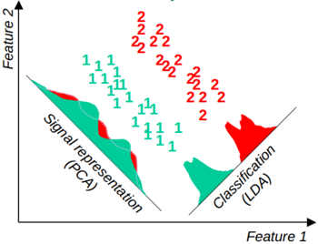